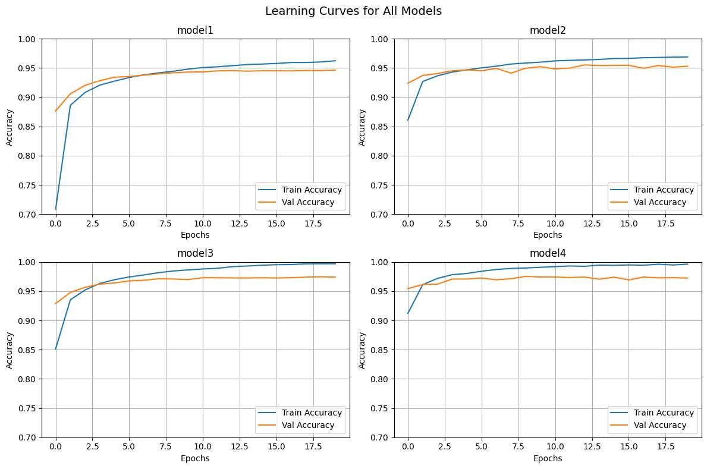
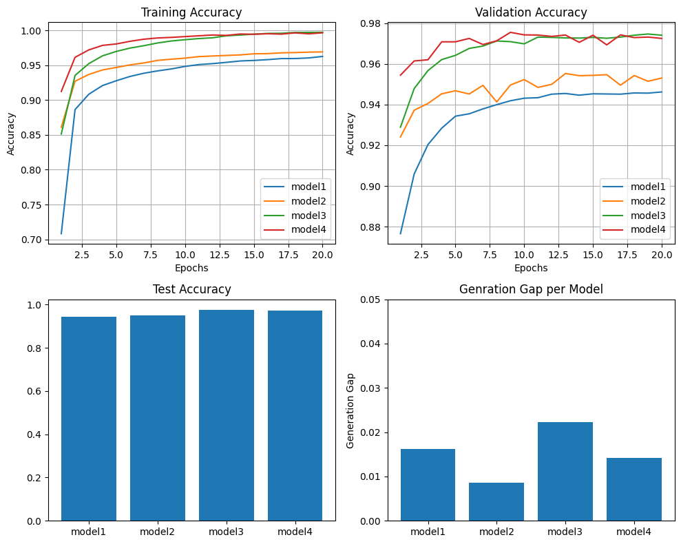
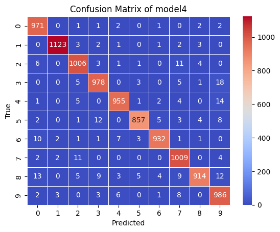
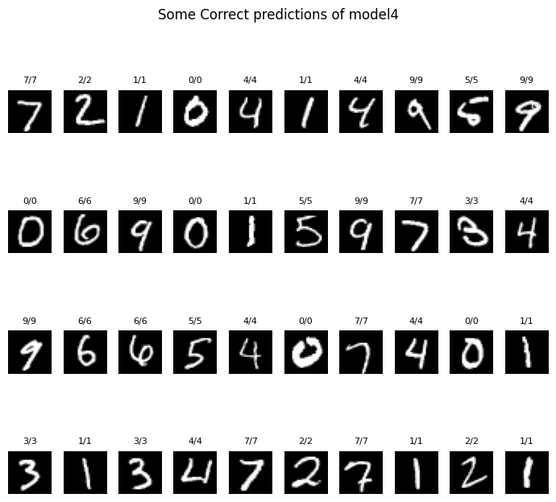

# Handwritten-Digit-Recognition
A Handwritten Digit Recognition model using MNIST dataset.
- In this project I tested 4 different ANN (Artificial Neural Network) models build using Keras Sequntial API, with different parameters and activation function.
- I build four architectures with varying hidden layers 16 & 64 neurons and activation functions Sigmoid & ReLU.
- I'm not just building a model, but also analyzing how changes in the model's parameters effect accuracy of model.
- Below **table** shows the accuracy of all models with thier respective parameters and activation function.
> Architecture format is number of nodes in: Input_layer - hidden_layer_1 - hidden_layer_2 - output_layer
  
| Model | Architecture | Activation | Training Accuracy | validation Accuracy |
| --- | --- | --- | --- | --- |
| Model 1| 784-16-16-10 | Sigmoid | 96.25 | 94.62 |
| Model 2 | 784-16-16-10 | ReLu | 96.39 | 95.53 |
| Model 3 | 784-64-64-10 | Sigmoid | 99.70 | 97.47 |
| Model 4 | 784-64-64-10 | ReLu | 98.98 | 97.55 |

- Model 1 and 3 have the same activation function but different numbers of neurons in the hidden layer; the same relation goes for Model 2 and 4.
- Model 1 and 2 have the same number of neurons in the hidden layer but different activation functions; the same relation goes for Model 3 and 4.
- Below are the graphs showcasing the accuracy of training, validation and testing per epoch of all 4 models and a confusion matrix for best model (model 4)

> Below are some concept I use in this project

## Sequnetial model
- the simplest type of model, allowing you to build a neural network by stacking layers in a linear fashion.
- It is ideal for feedforward networks, convolutional networks (CNNs), and recurrent networks (RNNs) where data flow is unidirectional from input to output.
## Flatten: 
- higher dimension data structure into 1D array.
- We can also give activation function to this, but if this is used for i/p layer then it doesn't require any activation function.
- In context of this project the input is 28x28 matrix of pixel values, which is converted to 784 vaues using Flatten.
## Softmax:
- Softmax converts a vector of values to a probability distribution.
- The sum of all output probabilities always equals 1, each value in the output vector is in the range (0,1).
-  Ideal for multi-class classification problems, where inputs might be negative or positive, ensuring the output represents a valid probability distribution.
-  It exaggerates the largest value and minimizes the smaller ones.

## model.compile()
- Defines the learning process before training begins.
- It defines 3 main things:
  - **Optimizer:** The optimizer controls how the neural network adjusts its weights to reduce errors.
  - **loss:** Measures the difference between actual value and predicted value.
  - **metrics=["accuracy"]:** It instructs the model to calculate this metric during training and testing. 

## model.fit()
- It is use to train the model
- If **metrics=["accuracy"]:** is given in model.compile(), then returns the history object which contain list of dictionary with keys loss and accuracy of training data, and val_loss and val_accuracy for validation data (if we specify validation_slit or validation_data).
- It also have some parameters:
  - **x:** Input training data
  - **y:** Target labels
  - **batch_size:** Defines the number of training samples processed by a model in a single iteration before updating its internal weights. It's default value is 32.
  - **epochs:** An integer representing number of full pass over the entire training dataset.
  - **verbose:** It controls how much information you see on your screen while model is training. It has 4 modes:
    - **0:** Silent
    - **1:** Progress bar for each epoch.
    - **2:** A single summary line ater each epoch is finished.
    - **auto:** Automatically chooses the best mode based on your environment (usually it behave as 1).
  - **validation_split:** It separates a fixed set of samples once at the very beginning of the training process and uses that same set for evaluation at the end of every epoch. It's value floats between 0 and 1.

## model.evaluate()
- It used to evaluate a trained model on a given dataset.
- It has following parameters:
  - **x:** Input test data
  - **y:** Target data
  - **batch_size:** Number of samples per batch
  - **verbose:** Controls how much information you see on your screen.
  - **return_dict:** If True, returns a dictionary of metric values. Default value is False.
