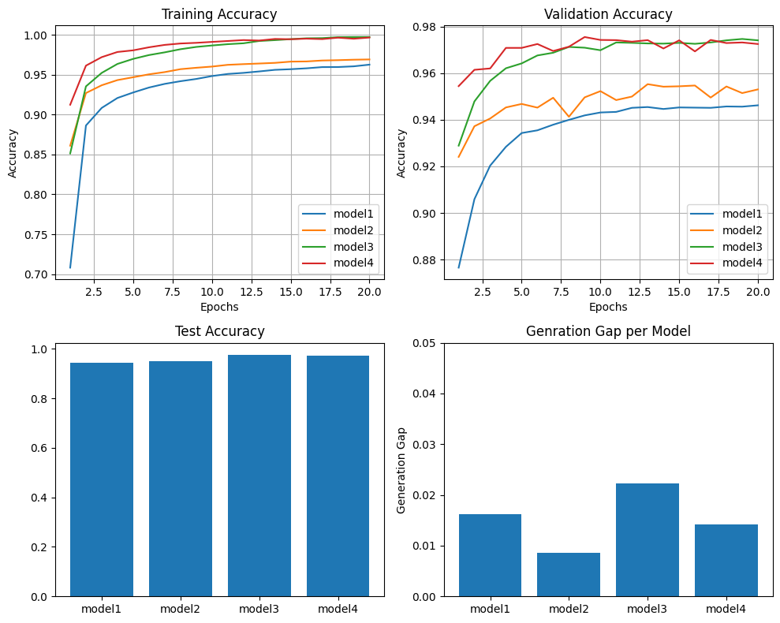
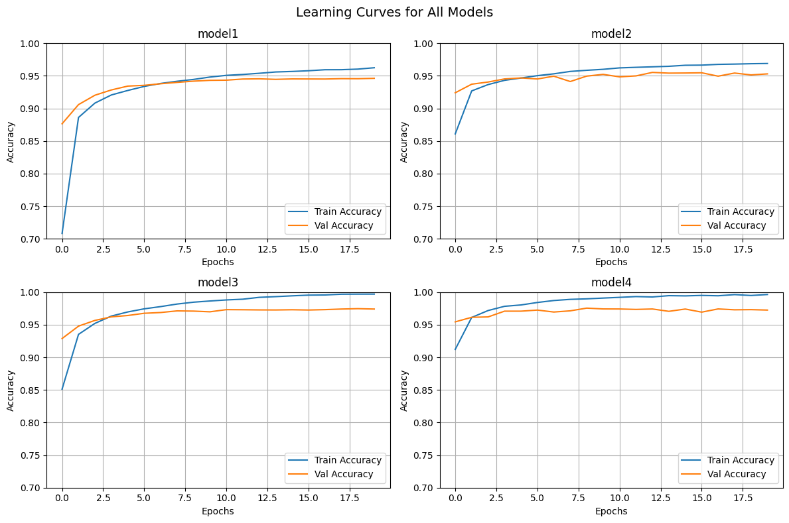
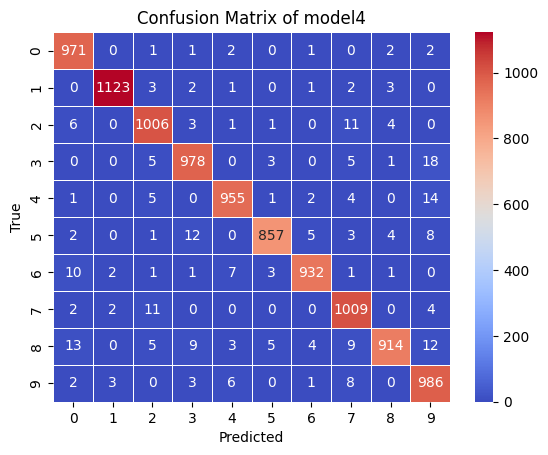
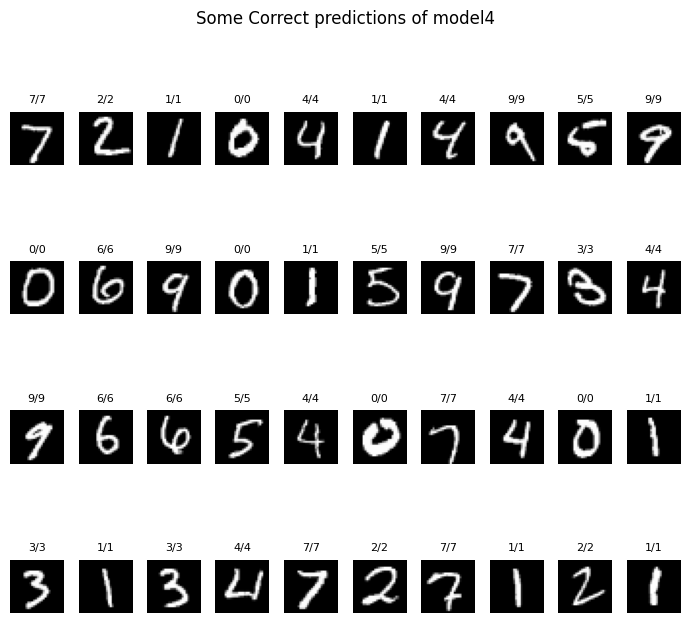

# Handwritten-Digit-Recognition
A Handwritten Digit Recognition model using MNIST dataset.
- In this project I tested 4 different ANN (Artificial Neural Network) models build using Keras Sequntial API, with different parameters and activation function.
- I build four architectures with varying hidden layers 16 & 64 neurons and activation functions Sigmoid & ReLU.
- I'm not just building a model, but also analyzing how changes in the model's parameters effect accuracy of model.

## Information table about all models
### Table 1
- Below **table 1** shows the architecture of all the models
- Architecture format is number of nodes in: Input_layer - hidden_layer_1 - hidden_layer_2 - output_layer

| Model | Architecture | Activation | Total parameters |
| --- | --- | --- | --- |
| Model 1| 784-16-16-10 | Sigmoid | 13002 |
| Model 2 | 784-16-16-10 | ReLu | 13002 |
| Model 3 | 784-64-64-10 | Sigmoid | 55050 |
| Model 4 | 784-64-64-10 | ReLu | 55050 |

### Table 2
- Below **table 2** shows the training and validation accuracy, Generation Gap, and epochs to best validation accuracy.

| Model | Train acc | Val acc | Gen Gap | Epochs to Best val acc |
| --- | --- | --- | --- | --- |
| Model 1 | 96.25 | 94.62 | 0.0162 | 20 |
| Model 2 | 96.39 | 95.53 | 0.0085 | 13 |
| Model 3 | 99.70 | 97.47 | 0.0223 | 19 |
| Model 4 | 98.98 | 97.55 | 0.0142 | 9 |

- Model 1 and 3 have the same activation function but different numbers of neurons in the hidden layer; the same relation goes for Model 2 and 4.
- Model 1 and 2 have the same number of neurons in the hidden layer but different activation functions; the same relation goes for Model 3 and 4.

## Graphs
- Below are the graphs showcasing the accuracy of training, validation and testing per epoch of all 4 models and a confusion matrix for best model (model 4)

### Graph 1

1. From **Training and Validation accuracy** graph
  - We can classify models in 2 categories: activation function and total number of parameters.
  - And in both the classes, model with **ReLU** activation function outperforms the model with **Sigmoid** activation function.
    - Because Sigmoid function squashed value between 0 to 1, which can cause the [*Vanishing Gradient Problem*](#vanishing-gradient-problem).
    - But in ReLU gradient didn't shrink much, it works on 2 case; if input is negative return 0, else positive value, which helps reducing noise.
  - Now is we talk about Total parameters
    - we can see model with higher number of total parameter is performing good than model with lower number of total parameter
    - We can see the huge difference between model with higher number of parameters (model 3 & 4) and model with lower number of parameters (model 1 & 2), in both subgraphs (tarining accuracy and validation accuracy)
  - For details of model architecture and accuracies [click this](#table-1)

2. From Generation Gap per model Subgraph:
  - As we can see all models has very low generation gap; all gaps are **below 0.025**, which is very small
  - On MNIST, gaps below 0.05 are ***generally acceptable***
  - So I can say no model is **overfitting**.
  - For generation gap numbers [click this](#table-2)
  - And to confirm it, below are the learning curves (training vs validation accuracy) of all models.

### Graph 2

- So by observing all models' learning curve, I can say no model is overfitting. Because:
  - All the generation gaps is very low
  - And the learning curve shows both training and validation accuracy are staying close and both are improving.

### Graph 3 (Confusion Matrix)
- Plotting confusion matrix of best model,
- Choosing the best model can vary on what metrics we are looking at.
  - If we only consider validation accuracy, then model 4 is best model, and
  - If we also consider the computational cost, then model 4 might not be the best model, because model 1 and model 2 have significantly fewer parameters than model 3 and model 4, which reduces the computational cost.
- But for now I'm only considering validation accuracy, which is ***Model 4.***

- In confusion matrix:
  - Each cell shows the number of correct predictions on test dataset.
  - The diagonal elements of the matrix represent correct predictions
  - And off-diagonal elements of the matrix represent incorrect predictions.

### Graph 4 (Some predictions of best model)
- Format: True label/Predicted label <br>


## Conclusion
- This project implemented and evaluated multiple Artificial Neural Network (ANN) architectures for handwritten digit recognition using the MNIST dataset.
- Several models were developed using the Keras Sequential API by varying architectural parameters such as the number of hidden layers, neuron counts, and activation functions while keeping the optimizer (Adam) and loss function (sparse categorical crossentropy) consistent.
- The experimental results demonstrated that increasing the depth and number of neurons generally improved classification performance up to a certain point. The best-performing model achieved high accuracy on the test dataset while maintaining a small generation gap, indicating that the model learned meaningful patterns without significant overfitting.
- Analysis of the learning curves confirmed stable training behavior, and the confusion matrix showed that most digits were classified correctly, with only minor confusion between visually similar digits.
- Overall, the results confirm that even relatively simple ANN architectures can achieve strong performance on the MNIST dataset.

## Future Scope 
- Implement Convolutional Neural Networks (CNNs) and compare their performance with the best ANN model, as CNNs are known to better capture spatial features in image data.
- Develop a real-time digit recognition application that allows users to draw digits on screen and obtain instant predictions from the trained model.

> Below are some concept I use in this project (for my revision)

## Sequnetial model
- the simplest type of model, allowing you to build a neural network by stacking layers in a linear fashion.
- It is ideal for feedforward networks, convolutional networks (CNNs), and recurrent networks (RNNs) where data flow is unidirectional from input to output.
## Flatten: 
- higher dimension data structure into 1D array.
- We can also give activation function to this, but if this is used for i/p layer then it doesn't require any activation function.
- In context of this project the input is 28x28 matrix of pixel values, which is converted to 784 vaues using Flatten.
## Softmax:
- Softmax converts a vector of values to a probability distribution.
- The sum of all output probabilities always equals 1, each value in the output vector is in the range (0,1).
-  Ideal for multi-class classification problems, where inputs might be negative or positive, ensuring the output represents a valid probability distribution.
-  It exaggerates the largest value and minimizes the smaller ones.

## model.compile()
- Defines the learning process before training begins.
- It defines 3 main things:
  - **Optimizer:** The optimizer controls how the neural network adjusts its weights to reduce errors.
  - **loss:** Measures the difference between actual value and predicted value.
  - **metrics=["accuracy"]:** It instructs the model to calculate this metric during training and testing. 

> WHY ARE YOU HERE?

## model.fit()
- It is use to train the model
- If **metrics=["accuracy"]:** is given in model.compile(), then returns the history object which contain list of dictionary with keys loss and accuracy of training data, and val_loss and val_accuracy for validation data (if we specify validation_slit or validation_data).
- It also have some parameters:
  - **x:** Input training data
  - **y:** Target labels
  - **batch_size:** Defines the number of training samples processed by a model in a single iteration before updating its internal weights. It's default value is 32.
  - **epochs:** An integer representing number of full pass over the entire training dataset.
  - **verbose:** It controls how much information you see on your screen while model is training. It has 4 modes:
    - **0:** Silent
    - **1:** Progress bar for each epoch.
    - **2:** A single summary line ater each epoch is finished.
    - **auto:** Automatically chooses the best mode based on your environment (usually it behave as 1).
  - **validation_split:** It separates a fixed set of samples once at the very beginning of the training process and uses that same set for evaluation at the end of every epoch. It's value floats between 0 and 1.

## model.evaluate()
- It used to evaluate a trained model on a given dataset.
- It has following parameters:
  - **x:** Input test data
  - **y:** Target data
  - **batch_size:** Number of samples per batch
  - **verbose:** Controls how much information you see on your screen.
  - **return_dict:** If True, returns a dictionary of metric values. Default value is False.

## Vanishing and Exploding Gradient Problem
- ANN models trained using Bacpropagation Algorithm (updating weights based on slope(gradient) ).
  1. Compute the error at the output layer.
  2. Propagate the error backward through hidden layers.
  3. Update the ***weights using gradient descent***:
  ```
  W(new)=W(old)-a∂E/∂W(old)

  [Multiplying from negative in: a∂E/∂W(old);  ensures the movement in lower value (minimum)]
  ```
  - We repeat this process until the loss is minimized (convergence).
- In here *Vanishing and Exploding Gradient* problem comes in.
- ### Vanishing Gradient Problem:
  - The problem happens when gradients become too small during backpropagation, preventing deep neural networks from learning effectivel (weights does not update), especially in **early layers.**
  - Why it affect the Early layers the most?
    - Because backpropagation uses the chain rule, meaning gradients are multiplied layer by layer:
    ``` 
    ∂E​/∂W1 ​= ∂E/∂Wn ​× ∂Wn/​∂Wn-1​ ​× ⋯ × ∂W2/​∂W1​​
    ```
    - So for early layers, their gradient is multiple of many layers, which makes it very small.
    - For a good learning:
      -  Error E would be low
      -  Gradients would be ***small everywhere***, not just in early layers
    - But in vanishing gradients:
      - Error may still be high
      - Only **early layers** have near-zero gradients, this cause learning is blocked, not complete.
  - Why this happens?
    - Activation functions like sigmoid function or tanh, which squash values into small ranges
    - Deep architectures with many layers<br>
    As gradients pass through each layer, they shrink exponentially.
- ### Exploding Gradient Problem:
  - It is a opposite of **Vanishing gradient problem.**
  - During backpropagation, gradients are passed backward through layers. In this case, instead of shrinking, they grow exponentially as they move backward.
  - This leads to:
    - Extremely large weight updates
    - Model becoming unstable
    - The model may: Diverge (never converage), crash numerically
